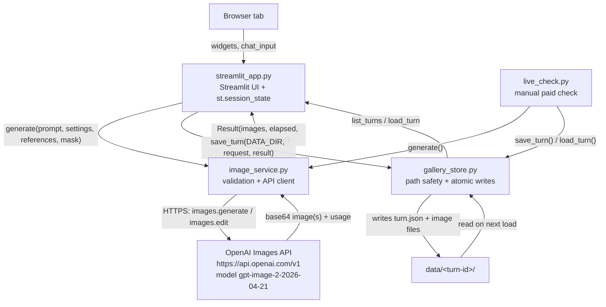

# Architecture

## Request and data flow

`live_check.py` calls `image_service.generate()` and `gallery_store` directly,
bypassing the Streamlit UI, to exercise the same generate, edit, and
mask-edit path end to end against the real API.

## Main types and where they live

`image_service.py`:
- `Settings` (frozen dataclass): output controls (size, quality, count,
  output_format, compression). `validate()` raises `ValueError` before any
  request is sent.
- `Picture` (frozen dataclass): decoded image `bytes` plus its verified
  `format`, `width`, `height`.
- `Result` (frozen dataclass): a completed API response, holding `images`,
  `elapsed`, `usage`, and `request_id`.

`gallery_store.py`:
- `Request` (frozen dataclass): one submission, with id, conversation and
  parent links, prompt text, `Settings`, reference `Picture`s, and an
  optional mask.
- `Turn` (frozen dataclass): a persisted, completed submission. It carries
  the same identifying fields plus `settings` as a plain dict, and
  image/reference/mask filenames rather than bytes, since the bytes live on
  disk under `data/<turn-id>/`. It also records `created`, `elapsed`,
  `usage`, `request_id`, and the pinned `model`.

`streamlit_app.py` holds UI state only, in `st.session_state`:
- `active_id` and `active_image` track which saved turn and image are
  currently selected as the editing base.
- `pending: Request | None` and `request_status: None | "queued" | "running"`
  form a small state machine that prevents a Streamlit rerun from replaying
  an in-flight API request.
- `unsaved: tuple[Request, Result] | None` holds a completed API result
  that has not yet been (or failed to be) written to disk, so the user can
  download it or retry saving without triggering a new paid request.
- `upload_epoch`, `error_message`, `view`, and `last_prompt` handle UI
  bookkeeping.
- Widget-bound keys (`quality`, `size_choice`, `output_format`, `count`,
  `custom_width`, `custom_height`, `compression`) persist with
  `persist_state="session"`.

Session state is per-browser-tab and is not the source of truth. On a fresh
session, `gallery_index()` rebuilds the visible gallery entirely from
`data/` via `gallery_store.list_turns()`.

## External systems

The only external system called by this code is the OpenAI Images API
(`https://api.openai.com/v1`, through the `openai` Python SDK's
`AsyncOpenAI` client, using `images.generate` and `images.edit` against the
model `gpt-image-2-2026-04-21`). There is no database, message queue, or
other external service in this repository.
